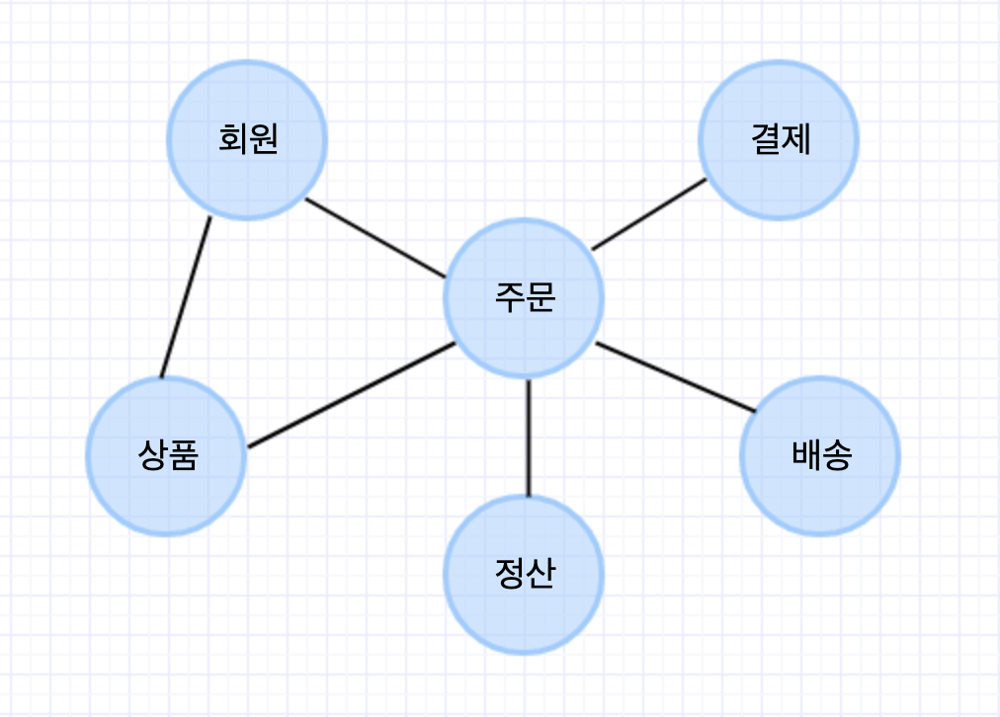
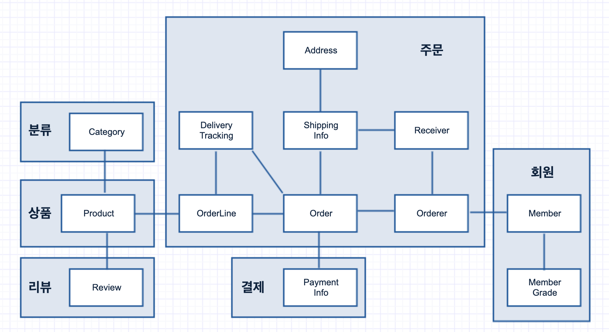

# DDD (Domain-Driven-Design) 
> DDD start! 도메인 주도 설계 구현과 핵심 개념 익히기를 읽으며 정리한 내용 입니다.

DDD란 무엇일까? 
> 비즈니스 도메인별로 공통용어(Ubiquitous Language)를 사용하며 도메인의 프로세스/정책 별로 Context를 나누고,
> 이러한 Bounded Context를 Context Map으로 도식화를 하는 전략설계와 Presentation, Service, Domain, Infrastructure 계층 구조로 설계를 하여 어플리케이션간의 의존성은 최소화 하고 응집도를 최대화 하는것이다.

## 1. 도메인 모델 시작
* 하나의 도메인은 하위의 여러 도메인으로 나눌 수 있다.
* 도메인 마다 고정된 하위 도메인이 존재하는 것은 아니다.
* 도메인을 어떻게 구성할지 여부는 상황에 따라 달라진다.


### 도메인 모델
기본적으로 도메인 모델은 특정 도메인을 개념적으로 표현 한 것.
즉, 도메인 모델을 사용하면 여러 관계자들이 동일한 모습으로 도메인을 이해하고 도메인 지식을 공유하는데 도움이 된다.

도메인 모델 표현 방식
- 객체 기반 주문 도메인 모델링 (주요 데이터 구성을 파악하고 기능과 데이터 보여주기 적합)
- 클래스 다이어그램, 상태 다이어그램을 이용한 상태 모델링
- 이외에도 그래프 이용한 모델링 등

### 도메인 모델 패턴

#### 계층(아키텍처) 구성

|계층(Layer)|설명
|----|--------------------------------------------------------|
|사용자인터페이스(UI) 또는 표현(Presentation)|사용자의 요청을 처리하고 정보를 보여준다.(Controller)|
|응용(Application|사용자가 요청한 기능을 실행 / 업무 로직을 직접 구현하지 않으며 도메인 계층을 조합해 기능을 실행 |
|도메인|시스템이 제공할 도메이느이 규칙을 구현 (Aggregate, Entity)|
|인프라스트럭처(Infrastructure)|데이터베이스나 메세징 시스템과 같은 외부 시스템과의 연동 처리(DB 연동, Message Queue, SMTP Email, External API)|

* 도메인 모델 패턴
    * 해당 도메인에 규칙을 구현한 코드가 도메인 계층에 위치하고, 이런 도메인 규칙을 객체 지향 기법으로 구현하는 패턴
        (서비스 계층은 단순히 엔티티에 필요한 요청을 위임하는 역할)
    * 핵심 규칙을 구현한 코드는 도메인 모델에만 위치하므로, 규칙이 바뀌거나 확장해야할 때 다른 코드에 영향을 덜 주고 변경 내역을 모델에 반영할 수 있다.
    
> cf. 트랜잭션 스크립트 패턴
> 
> 엔티티에는 비즈니스 로직이 거의 없고 서비스 계층에서 대부분 비즈니스 로직을 처리하는 것.
    
#### 도메인 모델 도출
기획서, 유스 케이스, 사용자 스토리와 같은 요구 사항과 관련좌의 대화를 통해 도메인을 이해하는 것이 첫 시작!
도메인 모델링 때 모델을 구성하는 `핵심 구성요소`, `규칙`, `기능` 을 찾아야 한다.

#### 엔티티와 밸류
도메인을 올바르게 설계하고 구현하기 위해서는 엔티티와 밸류의 차이를 명확하게 이해하고 제대로 구분하는 것이 도메인을 구현하는데 있어 중요!

##### 엔티티
식별자를 갖는다. (각 엔티티는 서로 다른 식별자를 갖는다. ex. 주문은 각 주문마다 주문번호가 다르며 `주문번호` 가 식별자가 됨)

식별자 생성은 사용 기술과 특징에 따라 다르나 흔히 아래와 같은 방식을 사용한다.
(⚠ 같은 시간에 동시에 식별자를 생성할 때 같은 식별자가 만들어지면 안된다.)

- 특정 규칙에 따라 생성
- UUID 사용
- 값을 직접 입력
- 일련번호 사용(Oracle 시퀀스나 MySQL 자동 증가 컬럼 사용)

##### 밸류
개념적으로 완전한 하나를 표현할 때 사용 (ex. 주소 = address1, address2, zipCode)

장점) 
- 코드의 의미를 더 잘 이해할 수 있도록 한다. (개념적으로 표현된 것을 사용해 의미를 파악하기 쉬움)
- 밸류 타입을 위한 기능을 추가할 수 있다. 

밸류 객체의 데이터 변경할 때 기존 데이터 변경 보다 변경한 데이터를 갖는 새로운 밸류 객체 생성 방식 선호.
`불변 객체 (데이터 변경 기능을 제공하지 않는 타입)`로 구현하게 되면 보다 안전한 코드를 작성할 수 있다.
> 불변 객체는 참조 투명성과 스레드에 안전하다.

##### 도메인 모델에 set 메서드 넣지 않기
set 메서드는 도메인의 핵심 개념이나 의도를 코드에서 사라지게 한다.
또한, 도메인 객체 생성 시 완전한 상태가 아닐 수도 있다.
도메인 객체가 불완전한 상태로 사용되는 것 방지 하려면 생성자를 통해 필요한 데이터를 모두 받아야 한다.

## 2. 아키텍처 개요

### 계층 구조 아키텍처

```text
Application(service) -> Domain(entity) -> Infrastructure(DB, rule Engine, messaging)
Application(service) -> Infrastructure(DB, rule Engine, messaging)
Domain(entity) -> Infrastructure(DB, rule Engine, messaging)
```

* 특성상 상위 계층에서 하위 계층으로의 의존만 존재, 하위 게층은 상위 계층의 의존하지 않는다.
* 하지만, 구현의 편리함을 위해 계층 구조를 유연하게 적용한다. ex. 응용 계층은 도메인 계층에 의존하지만 외부 시스템과의 연동으 ㄹ위해 더 아래 계층인 인프라스트럭처 계층에 의존하기도 함.

✅ 인프라스트럭처에 의존하면, `테스트의 어려움` 과 `기능 확장의 어려움` 의 문제가 발생한다.

그렇다면.. 어떻게 해결할 수 있을까? 해결 방법은? `DIP 적용하는 것`

> DIP (Dependency Inversion Principle) : 의존성 역전의 법칙
> 상위 계층이 하위 계층에 의존하는 의존 관계를 역전(반전) 시킴으로써 상위 계층이 하위 계층의 구현으로 부터 독립되게 할 수 있다.
> 추상화 하여 관계를 느슨하게 만들고 확장에 유연하게 만든다. 
> 
> ex. DIP를 구현하는 기법 중 하나가 DI (Dependency Injection) 이다.

* DIP는 고수준 모듈은 더 이상 저수준 모듈에 의존하지 않고 구현을 추상화한 인터페이스에 의존한다.
* 실제 사용할 저수준 구현 객체는 의존 주입을 이용해서 전달 받을 수 있다. 


* DIP 적용할 때 중요한 점
    * 하위 기능을 추상화한 인터페이스는 고수준 모둘 관점에서 도출한다. (추상화한 인터페이스가 고수준 모듈에 위치)

### 도메인 영역의 구성요소
* 도메인 영역의 모델은 도메인의 주요 개념을 표현하며 핵심이 되는 로직을 구현한다.

|요소|설명
|----|--------------------------------------------------------|
|엔티티 (Entity) | 고유의 식별자를 갖는 객체로 자신의 라이프 사이클을 갖는다. 도메인 모델의 테이터를 포함하며 해당 데이터와 관련된 기능을 함께 제공 (회원, 상품 같ㅇ른 도메인의 고유한 개념 표현)|
|밸류 (Value) | 고유의 식별자를 갖지 않는 객체, 개념적으로 하나인 도메인 객체의 속성을 표현할 때 사용. (주소, 구매 금액을 위한 금액(Money) 같은 타입) |
|애그리거트 (Aggregate) | 관련된 엔티티와 밸류 객체를 개념적으로 하나로 묶은 것. (주문 관련된 Order 엔티티, OrderLine 밸류, Orderer 밸류 객체  => `주문 애그리거트`) |
|레파지토리 (Repository) | 도메인 모델의 영속성을 처리. (DBMS 테이블에서 엔티티 객체를 로딩하거나 저장하는 기능 제공) |
|도메인 서비스 (Domain Service) | 특정 엔티티에 속하지 않는 도메인 로직 제공. 도메인 로직이 여러 엔티티와 밸류를 필요로 할 경우 도메인 서비스에서 로직을 구현한다. (ex. `할인 금액 계산`  쿠폰, 회원 등급, 구매 금액 등 다양한 조건을 이용해서 구현해야 할 경우)  |

#### 엔티티 (Entity) 와 밸류 (Value)
* 차이점
    * 도메인 모델의 엔티티: 데이터와 함께 도메인 기능을 함께 제공하는 객체 
        * 도메인 관점에서 기능을 구현하고 기능 구현을 `캡슐화` 해서 임의로 변경되는 것을 막는다.
        * 주문 엔티티의 경우, 주문 관련된 데이터 뿐 아니라 배송지 주소 변경을 위한 기능도 함께 제공
    * 두 개 이상의 데이터가 개념적으로 하나인 경우 밸류 타입으로 표현 가능 (밸류는 불편으로 구현 권장)
    
#### 애그리거트 (Aggregate)
* 도메인 모델에서 전체 구조를 이해하고 복잡한 도메인 모델을 관리하는데 도움이 된다.
* 애그리거트 구현 시 고려해야할 것이 많다. 애그리거트를 어떻게 구성했느냐에 따라 구현이 복잡해지기도 하고, 트랜잭션 범위가 달라지기도 하기 때문
* 선택한 구현 기술에 따라 애그리거트 구현에 제약이 생기기도 한다.

* 모델을 이해하는데 도움을 주며, 일관성을 관리하는 기준
    * 수 많은 객체를 애그리거트로 묶어서 바라보면 좀 더 상위 수준에서 도메인 모델 간의 관계를 파악할 수 있다.    
    * 애그리거트 경계
        * 한 애그리거트에 속한 객체는 다른 애그리거트에 속하지 않는다.
        * 경계 설정의 기본은 도메인 규칙과 요구사항 -> 도메인 규칙에 따라 함게 생성되는 구성요소는 한 애그리거트에 속할 가능성이 높다. 


* 애그리거트 루트 (애그리거트 루트 엔티티)   
    * 핵심 역할) 도메인 규칙에 따라 애그리거트의 일관성이 깨지지 않도록 한다.
        * 애그리거트에 속해 있는 엔티티와 밸류 객체를 이용해서 애그리거트가 구현해야 할 기능을 제공한다. 
    * 간접적으로 애그리거트 내의 다른 엔티티나 밸류 객체에 접근하게 된다. 애그리거트 단위로 구현 -> 내부 구현을 숨겨 `캡슐화` 하도록 한다.
    * 도메인 로직에 맞게 애그리거트의 상태를 관리
 
    * 불 필요한 중복을 피하고 애그리거트 루트를 통해서만 도메인 로직을 구현하게 하려면?
        * 단순히 필드를 변경하는 set 메서드를 공개(public) 범위로 만들지 않는다. (도메인 모델에서 공개 set 메서드는 가급적 피한다.)
            * 도메인 모델의 `엔티티` 나 `밸류` 에 공개 set 메서드만 넣지 않아도 일관성 깨질 가능성 줄어든다.
        * 밸류 타입은 불변으로 구현한다.
            * 불변 밸류 객체의 값을 변경하려면, 새로운 객체를 할당해서 변경해야 한다. 
            * 밸류 타입의 내부 상태를 변경하려면 애그리거트 루트를 통해서만 가능하다. -> 애그리거트 전체의 일관성을 올바르게 유지할 수 있음! 
    
#### 레파지토리 (Repository)
* 도메인 객체를 지속적으로 사용하려면 RDBMS, NoSQL, 로컬 파일과 같은 물리적인 저장소에 도메인 객체를 보관해야 한다. (이를 위한 도메인 모델 = 레파지토리)
* 애그리거트 단위로 도메인 객체를 저장하고 조회하는 기능을 정의한다.
* 애그리거트는 개념적으로 하나로 레파지토리는 애그리거트 전체를 저장소에 영속화 해야한다.
    * Order 애그리거트와 관련된 테이블이 세개 라면 레파지토리를 통해서 애그리거트 루트와 매핑된 테이블 뿐 아니라 애그리거트에 속한 모든 구성요소를 위한 테이블에 데이터를 저장해야 한다.
    * ex) Order 애그리거트는 OrderLine, Orderer 등 모든 구성 요소 포함 해야 함.

* repository interface 는 도메인 모델 영역에 속하며, 실제 구현 클래스는 infrastructure 영역에 속한다.

* 어떤 기술을 이용해서 레파지로티를 구현하느냐에 따라 애그리거트의 구현도 영향을 받는다.
    * ex) ORM 기술 중 JPA/Hibernate 를 사용하게 되면, 데이터 베이스 관계형 모델에 객체 도메인 모델을 맞춰야하는 경우가 있다.

### 인프라스트럭처 (Infrastructure) 개요
* 표현 영역, 응용 영역, 도메인 영역 지원
* 도메인 객체의 영속성 처리, 트랜잭션, SMTP Client, REST Client 등 다른 영역에서 필요로하는 프레임워크, 구현 기술, 보조 기능 지원
* 도메인 영역과 응용 영역에서 인프라스트럭처의 기능을 직접 사용하는 것보다, 두 영역에 정의한 인터페이스를 인프라스트럭처 영역에 구현하는 것이 시스템을 더 유연하고 테스트하기 쉽게 만들어 준다. - `DIP`

✅ `DIP` 가 주는 구현의 편리함 장점 만큼 DIP의 장점을 해치지 않는 범위에서 응용 영역과 도메인 영역에서 구현 기술에 대한 의존을 가져가는 것이 좋다.
(인프라스트럭처의 의존성을 없애는 것으로 자칫 구현을 더 복잡하고 어렵게 만들 수 있기 때문!) ex, @Transactional

### 모듈 구성
* 도메인이 크면 하위 도메인으로 나누고, 각 하위 도메인마다 별도 패키지를 구성한다.
* domain 모듈은 도메인에 속한 애그리거트 기준으로 패키지를 구성한다.
* 각 애그리거트와 모델과 레파지토리는 같은 패키지에 위치시킨다.

* 도메인이 복잡하면 도메인 모델과 도메인 서비스를 다음과 같이 별도 패키지에 위치 시킬 수 있다.
```
com.hyeon.order.domain.order: 애그리거트 위치
com.hyeon.order.domain.service: 도메인 서비스 위치
```

* 응용 서비스도 다음과 같이 도메인 별로 패키지 구분할 수 있다.
```
com.hyeon.catalog.application.product
com.hyeon.catalog.application.category
```

## 3. 애그리거트

### 트랜잭션 범위 
* 트랜잭션 범위는 작을 수록 좋다. 
    * DB 기준으로 한 트랜잭션이 한 개의 테이블을 수정하는 것과 세개의 테이블 수정하는 것은 성능에서 차이 발생
    * 한 트랜잭션에 두개 이상의 애그리거트를 수정하면 트랜잭션 충돌이 발생할 가능성이 높으며, 개수가 많아질 수록 처리량도 떨이지게 된다.
* 한 애그리거트에서 다른 애그리거트의 상태를 변경 하는 것은 애그리거트 간의 의존 결합도를 높여 결과적으로 애그리거트의 변경을 어렵게 만든다.
    
### ID를 이용한 애그리거트 참조
필드를 이용해 다른 애그리거트를 직접 참조하는 것은 개발자의 구현의 편리함을 제공한다.
하지만, `편한 탐색 오용`, `성능에 대한 고민`, `확장의 어려움` 문제를 야기 시킨다.
**ID를 이용해서 다른 애그리거트를 참조 하는 방법은 세가지 문제를 완화** 시킨다.

### ID를 이용한 참조와 조회 성능
ID를 이용한 애그리거트 참조는 지연 로딩과 같은 효과를 만드는데 지연 로딩과 관련된 대표적인 문제가 `N + 1 조회 문제` 이다.
> N + 1 조회 문제
>
> 조회 대상이 N 개 일 때 N개를 읽어오는 한번의 쿼리와 연관된 데이터를 읽어오는 쿼리를 N번 실행 하는 것을 말한다.
> 이는 더 많은 쿼리를 실행해서 전체 조회 속도가 느려지는 원인이 된다.
> 
> 해결 방법은 조인을 사용 한다. 
> - ID 참조 방식 -> 객체 참조 방식 변경 하고 즉시로딩을 사용하도록 매핑 설정을 바꾸는 것.
> - ID 참조 방식을 사용하면서 N+1 조회 문제를 발생하지 않도록 하기 위해서는? 세타 조인을 이용해서 전용 조회 쿼리를 사용한다.

* JPA에서 조회 전용 쿼리를 실행
* CQRS
    
### 애그리거트 간 집합 연관 

JPA 이용한 매핑 설정으로 ID 참조로 이용한 M:N 단방향 연관 구현 가능.
```java
@Entity
@Table(name = "product")
public class Product {
    @EmbeddedId
    private ProductId id;
    
    @ElementCollection
    @CollectionTable(name = "product_category",
                joinColumns = @JoingColumn(name = "product_id"))
    private Set<CategoryId> categoryIds;
    ...
}
```

### 애그리거트를 팩토리로 사용하기
애그리거트를 팩토리로 사용하면 도메인의 응집도를 높일 수 있다.

예시) 
Product 생성 가능한지 판단하는 코드와 Product를 생성하는 코드가 분리 되어 있다.
```java
public class RegisterProductService {
    public ProductId registerNewProduct(NewProductRequest req) {
        Store account = accountRepository.findStoreById(req.getStoreId());
        // 
        checkNull(account);
        if(account.isBlocked()) {
            throw new StoreBlockedException();
        }
        ProductId id = productRepository.nextId();
        Product product = new Product(id, account.getId, ...);
        productRepository.save(product);
        return id;
    }
    ...
}
```

위 코드는 중요한 도메인 로직 처리가 응용 서비스에 노출되었다.
어떻게 수정할 수 있을까?

`Product의 경우 제품을 생성한 Store의 식별자를 필요로 한다.`

이 힌트로 보았을 때, 도메인 기능을 넣기 위한 별도의 도메인 서비스나 팩토리 클래스를 만들 수도 있지만 
이 기능을 구현하기에 더 좋은 곳은 Store 애그리거트다.
**즉. Store의 데이터를 이용해서 Product를 생성한다.**

그렇기 때문에 Store에 Product를 생성하는 팩토리 메서드를 추가하면 Product를 생성할 때 필요한 데이터 일부를 직접 제공하면서
동시에 중요한 도메인 로직을 함께 구현할 수 있게 된다.
```java
public class Store extends Memeber {

    /* Product 애그리거트를 생성하는 팩토리 역할을 한다. */
    public Product createProduct(ProductId newProductId, ...) {
        if(isBlocked()) {
            throw new StoreBlockedException();   
        }
        return new Product(newProductId, getId(), ...);
    }
}
```

> ✅ 애그리거트가 갖고 있는 데이터를 이용해서 다른 애그리거트를 생성해야 한다면, 애그리거트에 팩토리 메서드를 구현하는 것을 고려해 볼 것!

## 4. 레포지토리와 모델 구현
* 엔티티와 밸류 매핑
* 밸류 컬렉션 매핑
* 애그리거트 로딩 전략과 영속성 전파
* 식별자 생성 기능

### JPA 를 이용한 레포지토리 구현
애그리거트를 어떤 저장소에 저장하느냐에 따라 레포지터리르 구현하는 방법이 다르다.
레포지토리 인터페이스는 애그리거트와 같이 `도메인 영역`에 속하고,
레포지토리를 구현한 클래스는 `인프라 스트럭처 영역` 에 속한다.

# Reference
* [DDD start! 도메인 주도 설계 구현과 핵심 개념 익히기](http://www.yes24.com/Product/Goods/27750871)
